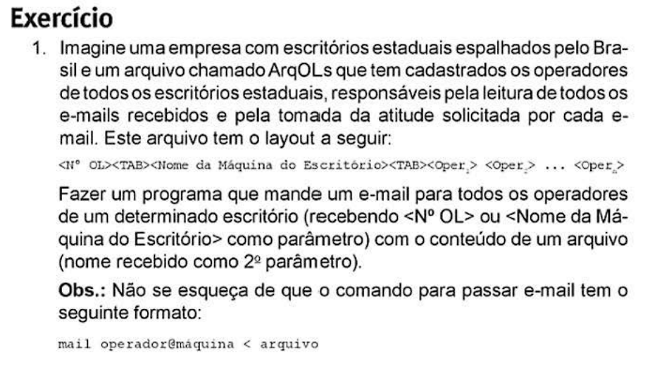

# Shell Linux Scripts

Bem-vindo ao repositório de scripts em Shell Linux! Este projeto contém exemplos e exercícios práticos organizados por capítulos, com descrições e imagens ilustrativas. Clique nas imagens abaixo para visualizar os detalhes de cada capítulo.

## Capítulos

### Capítulo 1: Introdução ao Shell e Comandos Básicos
- **Scripts**:
  - [`ex1_ls_glob.sh`](Capítulo-1/ex1_ls_glob.sh): Uso de `ls` com glob.
  - [`ex2_sequencias_comandos.sh`](Capítulo-1/ex2_sequencias_comandos.sh): Sequências de comandos no Shell.
  - [`ex3_mail_exemplos.sh`](Capítulo-1/ex3_mail_exemplos.sh): Exemplos com `mail`.
- **Imagem**: 

### Capítulo 2: Manipulação de Texto com Sed
- **Scripts**:
  - [`ex1_sed_exemplos.sh`](Capítulo-2/ex1_sed_exemplos.sh): Exemplos de uso do `sed`.
- **Imagem**: 

### Capítulo 3: Trabalhando com Dados
- **Scripts**:
  - [`ex1_buscar_sobrenome.sh`](Capítulo-3/ex1_buscar_sobrenome.sh): Busca por sobrenome.
  - [`ex2_listar_por_ddd.sh`](Capítulo-3/ex2_listar_por_ddd.sh): Listagem por DDD.
  - [`ex3_ultimo_parametro.sh`](Capítulo-3/ex3_ultimo_parametro.sh): Último parâmetro do comando.
  - [`ex4_usuarios_logados.sh`](Capítulo-3/ex4_usuarios_logados.sh): Usuários logados.
- **Imagem**: 

### Capítulo 4: Manipulação de Argumentos
- **Scripts**:
  - [`ex1_horas_pm_am.sh`](Capítulo-4/ex1_horas_pm_am.sh): Conversão de horário.
  - [`ex2_parametro_argumento.sh`](Capítulo-4/ex2_parametro_argumento.sh): Trabalhando com parâmetros.
  - [`ex3_programa_bom_dia.sh`](Capítulo-4/ex3_programa_bom_dia.sh): Programa "Bom Dia".
- **Imagem**: 

### Capítulo 5: Scripts Avançados
- **Scripts**:
  - [`ex1_ArqOLs.sh`](Capítulo-5/ex1_ArqOLs.sh): Manipulação de arquivos e listas.
- **Imagem**: 

### Capítulo 6: Entrada e Saída no Shell
- **Scripts**:
  - [`ex1_mandar_email.sh`](Capítulo-6/ex1_mandar_email.sh): Envio de e-mails.
  - [`ex2_ler_tela.sh`](Capítulo-6/ex2_ler_tela.sh): Leitura de entrada.
- **Imagem**: 

### Capítulo 7: Automação com Shell Scripts
- **Scripts**:
  - [`ex1_meurm.sh`](Capítulo-7/ex1_meurm.sh): Meu primeiro script de automação.
  - [`ex2_a_menu_ArqALs.sh`](Capítulo-7/ex2_a_menu_ArqALs.sh): Menu interativo.
  - [`ex2_b_manipula_arqOLs.sh`](Capítulo-7/ex2_b_manipula_arqOLs.sh): Manipulação avançada de arquivos.
- **Imagem**: 
